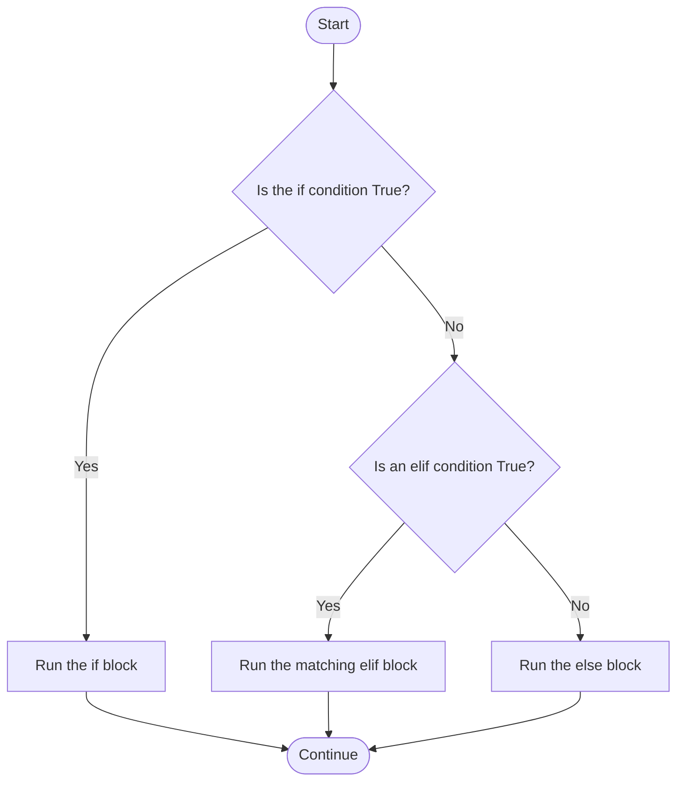

# Python If-Else

`if`, `elif`, and `else` let a Python program make decisions. Python evaluates conditions from top to bottom, runs the first matching block, and then skips the rest of that chain.


## Basic Syntax

```python
if condition:
    # Runs when condition is True
elif another_condition:
    # Runs only when the first condition is False
else:
    # Runs when all earlier conditions are False
```

Python uses indentation to define each block. Consistent four-space indentation is the usual convention.

## Decision Flow


