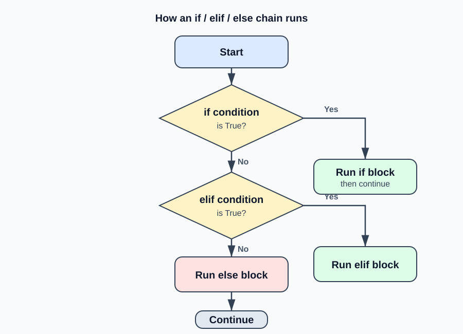
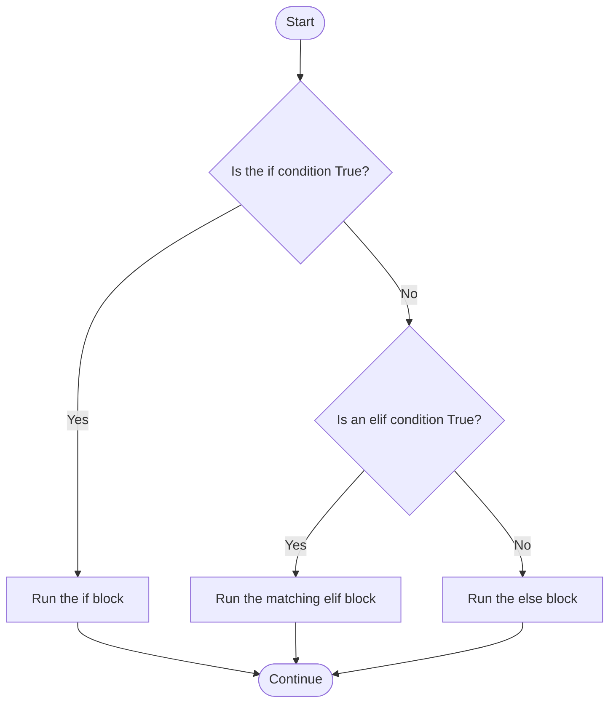

# Python If-Else

`if`, `elif`, and `else` let a Python program make decisions. Python evaluates conditions from top to bottom, runs the first matching block, and then skips the rest of that chain.



## Basic Syntax

```python
if condition:
    # Runs when condition is True
elif another_condition:
    # Runs only when the first condition is False
else:
    # Runs when all earlier conditions are False
```

Python uses indentation to define each block. Consistent four-space indentation is the usual convention.

## Decision Flow



## List Comprehensions: `if` and `if/else` in One Line

List comprehensions offer a compact way to create a list while applying conditional logic. They are useful for simple transformations, but a normal `if`/`else` block is often clearer when the logic becomes complex.

Use `if` at the end to **filter** values:

```python
numbers = [1, 2, 3, 4, 5, 6]
even_numbers = [number for number in numbers if number % 2 == 0]

print(even_numbers)  # [2, 4, 6]
```

Use `value_if_true if condition else value_if_false` before the `for` loop to choose a value for every item:

```python
numbers = [1, 2, 3, 4]
labels = ["even" if number % 2 == 0 else "odd" for number in numbers]

print(labels)  # ['odd', 'even', 'odd', 'even']
```

The conditional expression reads like a small `if`/`else` statement:

```python
result = "even" if number % 2 == 0 else "odd"
```
